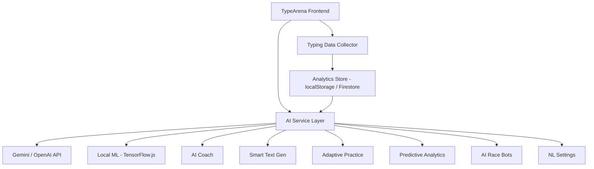
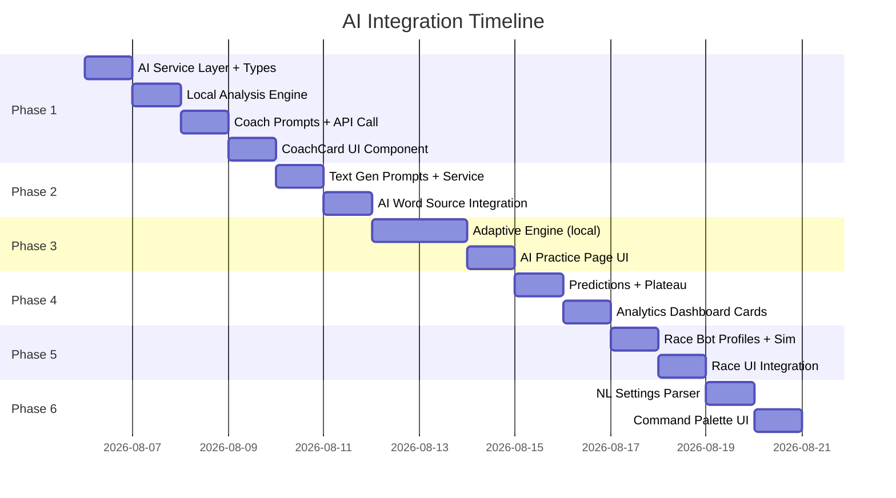

# 🧠 TypeArena AI Integration Roadmap

> A step-by-step blueprint for adding AI features to TypeArena.  
> Written so any agent (or dev) can pick up a phase and execute it independently.

---

## Architecture Overview



---

## Phase 1: AI Typing Coach (Post-Test Analysis)

> **Priority:** 🔴 HIGH — Highest impact, easiest to build  
> **Effort:** 2-3 days  
> **API needed:** Gemini Flash / GPT-4o-mini  

### What It Does
After every test, an AI coach analyzes the run data and gives **3-4 personalized, actionable tips**. Not generic garbage — real insights from the user's actual keystroke data.

### Example Output
```
🎯 Your rhythm breaks on capital letters — you lose ~180ms per shift key.
   Try: Practice the "Shift + letter" drill in the Practice tab.

📉 Accuracy dropped from 99% → 91% after the 40-second mark.
   This suggests finger fatigue. Try shorter 30s bursts for now.

🔥 Your bigram speed for "th" is 45ms (top 10%) but "qu" is 220ms (bottom 30%).
   Focus drill: qu-words like "quick, quest, queen, quote"

💡 You're averaging 72 WPM. To break 80, focus on reducing pause time
   between words — your inter-word gap is 340ms vs optimal 180ms.
```

### Implementation Plan

#### Step 1: Create the AI service layer
```
📁 src/lib/ai/
├── aiService.ts          ← Main service (API calls, rate limiting, caching)
├── coachPrompts.ts       ← System prompts & few-shot examples for the coach
├── types.ts              ← AI-related TypeScript types
└── localAnalysis.ts      ← Pre-processing that runs locally (no API needed)
```

#### Step 2: `src/lib/ai/types.ts`
```typescript
export type CoachInsight = {
  emoji: string;           // "🎯" | "📉" | "🔥" | "💡"
  category: "rhythm" | "accuracy" | "speed" | "endurance" | "technique";
  title: string;           // Short headline
  detail: string;          // 1-2 sentence explanation
  actionable: string;      // Concrete next step
  priority: 1 | 2 | 3;    // 1 = most important
};

export type CoachAnalysis = {
  insights: CoachInsight[];
  encouragement: string;   // Motivational closer
  focusArea: string;       // Single thing to work on next
  predictedWpm: number;    // "If you keep this up, you'll hit X WPM in Y days"
  predictedDays: number;
};

export type TypingProfile = {
  recentRuns: RunSummary[];          // Last 20 runs (WPM, accuracy, duration)
  weakBigrams: [string, number][];   // Bigram → avg delay in ms
  weakKeys: [string, number][];      // Key → error rate %
  avgWpm: number;
  avgAccuracy: number;
  consistencyTrend: "improving" | "stable" | "declining";
  totalTestsCompleted: number;
};
```

#### Step 3: `src/lib/ai/localAnalysis.ts`
This runs **100% locally** — no API call needed. It pre-computes the typing profile from localStorage data before sending to the AI.

```typescript
export function buildTypingProfile(runs: CompletedRun[]): TypingProfile {
  // 1. Compute average WPM, accuracy over last 20 runs
  // 2. Extract bigram timing data from keystroke samples
  // 3. Identify weak keys from keyErrors/keyTotals
  // 4. Detect trend (improving/stable/declining) via linear regression on WPM
  // 5. Return structured TypingProfile
}

export function computeBigramDelays(
  targetText: string,
  ghostSamples: GhostSample[]
): Map<string, number[]> {
  // Walk through ghost samples, compute time delta between consecutive chars
  // Group by bigram (2-char pair), return avg delay per bigram
}
```

#### Step 4: `src/lib/ai/coachPrompts.ts`
```typescript
export const COACH_SYSTEM_PROMPT = `
You are TypeArena Coach — a world-class typing instructor.
You analyze typing test results and give SHORT, SPECIFIC, ACTIONABLE feedback.

Rules:
- Max 4 insights per analysis
- Each insight must reference SPECIFIC data (exact numbers, exact keys/bigrams)
- Never be generic ("practice more" is BANNED)
- Always include one encouragement
- Predict when they'll hit their next WPM milestone
- Use the emoji categories: 🎯 technique, 📉 decline, 🔥 strength, 💡 tip, ⚡ speed

Return JSON matching the CoachAnalysis schema.
`;
```

#### Step 5: `src/lib/ai/aiService.ts`
```typescript
export async function getCoachAnalysis(
  run: CompletedRun,
  profile: TypingProfile,
  apiKey: string
): Promise<CoachAnalysis> {
  // 1. Build prompt with run data + profile
  // 2. Call Gemini Flash API (cheapest, fastest)
  // 3. Parse JSON response
  // 4. Cache result in sessionStorage keyed by run.id
  // 5. Return CoachAnalysis
}
```

#### Step 6: UI Component — `src/components/ai/CoachCard.tsx`
- Renders below the WPM chart on `ResultsPage`
- Shows insights as expandable cards with emoji headers
- Has a "Get AI Analysis" button (doesn't auto-fire to save API calls)
- Loading skeleton while waiting
- Stores API key in localStorage (user enters once in settings)

#### Step 7: Integration point — `ResultsPage.tsx`
```tsx
// Add after the Chart component:
<CoachCard run={run} />
```

---

## Phase 2: AI-Powered Smart Text Generation

> **Priority:** 🟠 HIGH — Makes typing tests way more engaging  
> **Effort:** 2 days  
> **API needed:** Gemini Flash  

### What It Does
Instead of random word soup, generate **contextual, interesting text** tailored to the user's level and preferences.

### Modes
| Mode | Description | Example |
|------|-------------|---------|
| **Topic-based** | User picks a topic, AI generates typing text about it | "space exploration", "cooking", "javascript" |
| **Story mode** | Progressive narrative that continues across tests | Each test is the next paragraph of an AI story |
| **Difficulty-matched** | Text difficulty auto-scales to user's WPM | Beginner: simple words. Expert: technical jargon |
| **Code generation** | Real-looking code snippets in chosen language | Python functions, React components, SQL queries |

### Implementation Plan

#### Step 1: `src/lib/ai/textGenPrompts.ts`
```typescript
export function buildTextGenPrompt(
  mode: "topic" | "story" | "adaptive" | "code",
  userWpm: number,
  options: { topic?: string; language?: string; prevContext?: string }
): string {
  // Build appropriate prompt based on mode
  // Include word count target, difficulty level, formatting rules
}
```

#### Step 2: `src/lib/ai/textGenService.ts`
```typescript
export async function generateTypingText(
  mode: string,
  options: TextGenOptions,
  apiKey: string
): Promise<string> {
  // 1. Build prompt
  // 2. Call API with low temperature (0.7) for consistency
  // 3. Post-process: strip markdown, normalize whitespace, validate length
  // 4. Cache generated texts (reuse across sessions)
  // 5. Return clean text string
}
```

#### Step 3: Add "AI Text" as a new word source
- In `TestControls.tsx`, add a new button in the language sub-bar: `✨ ai`
- When selected, show a topic input or dropdown
- In `SoloTestPage.tsx`, call `generateTypingText()` when this source is active

#### Step 4: Settings additions
```typescript
// Add to TestSettings type:
aiTextTopic?: string;
aiTextMode?: "topic" | "story" | "adaptive" | "code";
aiCodeLanguage?: string;
```

---

## Phase 3: Adaptive AI Practice Engine

> **Priority:** 🟡 MEDIUM — Builds on existing weak-key system  
> **Effort:** 3 days  
> **API needed:** Optional (can work locally + API for advanced)  

### What It Does
The current practice system identifies weak keys. The AI version goes deeper:
- Identifies weak **bigrams**, **trigrams**, and **word patterns**
- Generates custom drill text that **oversamples** your weak spots
- Adapts difficulty in real-time during a session
- Tracks improvement over time and adjusts focus areas

### Implementation Plan

#### Step 1: Enhanced local analysis — `src/lib/ai/adaptiveEngine.ts`
```typescript
export function generateAdaptiveDrill(
  weakBigrams: Map<string, number>,   // bigram → error rate
  weakTrigrams: Map<string, number>,  // trigram → error rate  
  targetWpm: number,
  drillLength: number                 // word count
): string {
  // 1. Score each weakness by severity
  // 2. Build word list that contains 60% weak patterns, 40% comfort words
  // 3. Arrange words so weak bigrams appear at natural positions
  // 4. Return drill text
}
```

#### Step 2: Real-time difficulty adjustment
```typescript
export function adjustDifficulty(
  currentAccuracy: number,
  targetAccuracy: number,   // 92-95% sweet spot for learning
  currentDrillLevel: number
): number {
  // If accuracy > 96%: increase difficulty (more weak patterns)
  // If accuracy < 88%: decrease difficulty (more comfort words)
  // Sweet spot 90-95%: maintain current level
}
```

#### Step 3: AI-enhanced drill generation (optional API call)
- Use Gemini to generate **readable sentences** that naturally contain the user's weak bigrams
- Much better UX than random word soup with forced bigrams

#### Step 4: New UI — `src/features/practice/AIPracticePage.tsx`
- Shows current weak spots with severity indicators
- "Start AI Drill" button
- Real-time difficulty indicator during practice
- Session summary showing improvement per weak area

---

## Phase 4: Predictive Analytics & Progress Forecasting

> **Priority:** 🟡 MEDIUM  
> **Effort:** 1-2 days  
> **API needed:** None (runs locally with TensorFlow.js or simple math)  

### What It Does
- Predicts when user will hit next WPM milestone (e.g., "You'll reach 80 WPM in ~12 days")
- Shows projected improvement curve on analytics dashboard
- Detects plateaus and suggests how to break through

### Implementation Plan

#### Step 1: `src/lib/ai/predictions.ts`
```typescript
export function predictMilestone(
  runs: CompletedRun[],
  targetWpm: number
): { estimatedDays: number; confidence: "low" | "medium" | "high" } {
  // 1. Extract WPM values with timestamps
  // 2. Fit simple linear regression (or exponential decay curve)
  // 3. Extrapolate to target WPM
  // 4. Confidence based on R² and sample size
}

export function detectPlateau(
  runs: CompletedRun[],
  windowSize: number = 20
): { isPlateau: boolean; duration: number; suggestion: string } {
  // 1. Check if WPM variance in last N runs is < threshold
  // 2. If plateau detected, suggest specific drills
}
```

#### Step 2: Add to `AnalyticsDashboard.tsx`
- New "AI Forecast" card with projected WPM curve
- Plateau detection warning banner
- Milestone countdown badge

---

## Phase 5: AI Race Bots

> **Priority:** 🟢 LOW — Fun feature, not critical  
> **Effort:** 2 days  
> **API needed:** None (deterministic simulation)  

### What It Does
Solo users can race against AI opponents with different personalities:
- **Steady Eddie** — Consistent 60 WPM, never makes mistakes
- **Speed Demon** — 120 WPM but 88% accuracy
- **The Learner** — Starts at user's WPM -10, slowly catches up
- **Mirror Match** — Replays user's previous best ghost

### Implementation Plan

#### Step 1: `src/lib/ai/raceBots.ts`
```typescript
export type BotProfile = {
  id: string;
  name: string;
  avatar: string;
  targetWpm: number;
  accuracy: number;
  consistency: number;     // How much WPM varies
  personality: string;     // Description shown in UI
};

export function simulateBotProgress(
  bot: BotProfile,
  elapsedMs: number,
  textLength: number
): number {
  // Returns charIndex at given elapsed time
  // Add slight randomness based on consistency rating
  // Simulate accuracy drops (backspace pauses)
}
```

#### Step 2: Integrate into solo test
- New "Race vs AI" button on SoloTestPage
- Bot selection modal with difficulty tiers
- Show bot progress bar alongside typing viewport
- Results comparison at end

---

## Phase 6: Natural Language Settings

> **Priority:** 🟢 LOW — Nice polish, not essential  
> **Effort:** 1 day  
> **API needed:** Gemini Flash  

### What It Does
User types a natural language command and the AI configures the test:
- *"give me a 2 minute test with hard words and numbers"*  
  → `{ mode: "time", value: 120, wordDifficulty: "hard", numbers: true }`
- *"I want to practice javascript code"*  
  → `{ mode: "custom", wordSourceId: "code", aiCodeLanguage: "javascript" }`

### Implementation Plan

#### Step 1: `src/lib/ai/nlSettings.ts`
```typescript
export async function parseNaturalLanguageSettings(
  userInput: string,
  currentSettings: TestSettings,
  apiKey: string
): Promise<Partial<TestSettings>> {
  // 1. Send user input + current settings schema to Gemini
  // 2. Ask it to return a JSON partial of TestSettings
  // 3. Merge with current settings
  // 4. Return updated settings
}
```

#### Step 2: Add command bar
- `Ctrl+K` or `/` opens a command palette overlay
- User types natural language
- AI parses → settings update → test regenerates

---

## Implementation Priority Order



---

## Technical Setup (Do This First)

### 1. API Key Management
```
📁 src/lib/ai/
└── config.ts
```
```typescript
const AI_KEY_STORAGE = "typearena-ai-key";

export function getAiApiKey(): string | null {
  try { return localStorage.getItem(AI_KEY_STORAGE); } catch { return null; }
}

export function setAiApiKey(key: string): void {
  try { localStorage.setItem(AI_KEY_STORAGE, key); } catch { /* ignore */ }
}

export function hasAiApiKey(): boolean {
  return !!getAiApiKey();
}
```

### 2. API Call Wrapper
```typescript
// src/lib/ai/aiService.ts
export async function callGemini(
  systemPrompt: string,
  userPrompt: string,
  options?: { temperature?: number; maxTokens?: number }
): Promise<string> {
  const apiKey = getAiApiKey();
  if (!apiKey) throw new Error("No API key configured");

  const res = await fetch(
    `https://generativelanguage.googleapis.com/v1beta/models/gemini-2.0-flash:generateContent?key=${apiKey}`,
    {
      method: "POST",
      headers: { "Content-Type": "application/json" },
      body: JSON.stringify({
        systemInstruction: { parts: [{ text: systemPrompt }] },
        contents: [{ parts: [{ text: userPrompt }] }],
        generationConfig: {
          temperature: options?.temperature ?? 0.7,
          maxOutputTokens: options?.maxTokens ?? 1024,
          responseMimeType: "application/json",
        },
      }),
    }
  );

  if (!res.ok) throw new Error(`Gemini API error: ${res.status}`);
  const data = await res.json();
  return data.candidates?.[0]?.content?.parts?.[0]?.text ?? "";
}
```

### 3. Settings UI for API Key
- Add an "AI Settings" section in the advanced settings popover
- Simple input field for Gemini API key
- Test connection button
- Key is stored in localStorage (never sent to your server)

---

## File Structure (Final)

```
📁 src/lib/ai/
├── config.ts              ← API key management
├── aiService.ts           ← Core API wrapper (callGemini)
├── types.ts               ← All AI-related types
├── localAnalysis.ts       ← Bigram/trigram analysis (no API)
├── coachPrompts.ts        ← Coach system prompt + few-shot
├── coachService.ts        ← getCoachAnalysis()
├── textGenPrompts.ts      ← Text generation prompts
├── textGenService.ts      ← generateTypingText()
├── adaptiveEngine.ts      ← Adaptive drill generation (local)
├── predictions.ts         ← WPM forecasting & plateau detection
├── raceBots.ts            ← Bot profiles & simulation
└── nlSettings.ts          ← Natural language → TestSettings

📁 src/components/ai/
├── CoachCard.tsx           ← Post-test AI insights card
├── AiTextConfig.tsx        ← Topic/mode selector for AI text gen
├── PredictionCard.tsx      ← WPM forecast on analytics page
├── BotSelector.tsx         ← AI race opponent picker
├── CommandPalette.tsx      ← Ctrl+K natural language input
└── ApiKeySetup.tsx         ← API key input & validation
```

---

## Cost Estimates (Gemini Flash)

| Feature | Tokens per call | Cost per call | Calls per session |
|---------|----------------|---------------|-------------------|
| Coach Analysis | ~800 in + 400 out | ~$0.0003 | 1-3 |
| Text Generation | ~200 in + 300 out | ~$0.0001 | 1-5 |
| NL Settings | ~300 in + 100 out | ~$0.0001 | 0-2 |
| **Total per session** | | **~$0.001** | |

> [!TIP]
> At Gemini Flash pricing, a user would need to do **1,000 sessions** to spend $1. Basically free.

---

## Rules for Implementing Agents

> [!IMPORTANT]
> Follow these rules when building any phase:

1. **Never auto-call the API** — Always require a user click ("Get AI Analysis", "Generate Text")
2. **Always cache results** — Same run ID = same analysis. Store in sessionStorage
3. **Graceful degradation** — If no API key is set, hide AI features cleanly. Never error.
4. **Local first** — Do as much analysis locally as possible before calling the API
5. **JSON responses only** — Use `responseMimeType: "application/json"` to get structured data
6. **Rate limit** — Max 1 API call per 3 seconds. Queue additional requests.
7. **Never send personal data** — Only send typing metrics (WPM, accuracy, key stats). Never usernames or emails.
8. **Types are mandatory** — Every AI response must have a TypeScript type. Parse + validate before using.
